# Roadmap — ios-ota-builder

Planned improvements to make the OTA pipeline faster, clearer, and more pleasant to use day to day. The pipeline already works for its core job (build → publish → install on iPhone); this roadmap focuses on **quality-of-use** enhancements.

**Detailed specs:** every item below is fully described in [`roadmap-features.md`](roadmap-features.md).

---

## Status legend

| Status | Meaning |
|--------|---------|
| `Planned` | Not started |
| `In Progress` | Active development |
| `Done` | Shipped on `main` |
| `Deferred` | Intentionally postponed |

All items below start as **Planned**.

---

## Phases

The **Phase** column in the summary table below is canonical. The diagram is illustrative.

```mermaid
flowchart LR
  subgraph phase1 [Phase1_QuickWins]
    A[F12_auto_increment]
    B[F02_qr_metadata]
    C[F03_latest_redirect]
  end
  subgraph phase2 [Phase2_Dashboard]
    D[F06_copy_links]
    E[F07_badges]
    F[F15_notifications]
  end
  subgraph phase3 [Phase3_InstallAndUI]
    G[F01_rich_install]
    H[F04_app_icon]
    I[F11_dark_mode]
  end
  subgraph phase4 [Phase4_Pipeline]
    J[F13_dirty_git]
    K[F14_build_lock]
    L[F17_progress]
  end
  subgraph phase5 [Phase5_OpsAndFuture]
    M[F18_health]
    N[F24_pinned]
    O[F25_webhook]
  end
  phase1 --> phase2 --> phase3 --> phase4 --> phase5
```

---

## Summary table

| ID | Feature | Phase | Priority | Effort | Status | Spec |
|----|---------|-------|----------|--------|--------|------|
| F01 | Rich install page | 3 | P1 | M | Done | [F01](roadmap-features.md#f01) |
| F02 | QR code on install page | 1 | P0 | S | Done | [F02](roadmap-features.md#f02) |
| F03 | `/latest/<project-id>` redirect | 1 | P0 | S | Done | [F03](roadmap-features.md#f03) |
| F04 | App icon from archive | 3 | P1 | M | Done | [F04](roadmap-features.md#f04) |
| F05 | Auto release notes | 3 | P2 | M | Done | [F05](roadmap-features.md#f05) |
| F06 | Copy-to-clipboard links | 1 | P0 | S | Done | [F06](roadmap-features.md#f06) |
| F07 | Visual badges (Debug/Release, latest) | 1 | P0 | S | Done | [F07](roadmap-features.md#f07) |
| F08 | Table metadata (size, duration, config) | 2 | P1 | S | Done | [F08](roadmap-features.md#f08) |
| F09 | Mobile-friendly dashboard layout | 2 | P2 | M | Done | [F09](roadmap-features.md#f09) |
| F10 | Commit links via `repo_url` | 2 | P2 | S | Done | [F10](roadmap-features.md#f10) |
| F11 | Dark mode | 2 | P3 | S | Done | [F11](roadmap-features.md#f11) |
| F12 | Auto-increment build number | 1 | P0 | M | Done | [F12](roadmap-features.md#f12) |
| F13 | Dirty git warning | 4 | P2 | S | Done | [F13](roadmap-features.md#f13) |
| F14 | Per-project build lock | 4 | P2 | S | Done | [F14](roadmap-features.md#f14) |
| F15 | Build completion notifications | 1 | P1 | S | Done | [F15](roadmap-features.md#f15) |
| F16 | `--dry-run` preflight | 4 | P2 | S | Done | [F16](roadmap-features.md#f16) |
| F17 | Live build progress | 4 | P2 | M | Done | [F17](roadmap-features.md#f17) |
| F18 | `/health` endpoint | 5 | P2 | S | Done | [F18](roadmap-features.md#f18) |
| F19 | Server status panel | 5 | P2 | M | Done | [F19](roadmap-features.md#f19) |
| F20 | Failed builds in dashboard | 5 | P2 | M | Done | [F20](roadmap-features.md#f20) |
| F21 | `ota_status.sh` script | 5 | P2 | S | Done | [F21](roadmap-features.md#f21) |
| F22 | Shell aliases documentation | 5 | P3 | S | Done | [F22](roadmap-features.md#f22) |
| F23 | Changelog between builds | 4 | P2 | M | Planned | [F23](roadmap-features.md#f23) |
| F24 | Pinned builds (retention exempt) | 5 | P2 | M | Planned | [F24](roadmap-features.md#f24) |
| F25 | Webhook build on git push | 5 | P3 | L | Planned | [F25](roadmap-features.md#f25) |
| F26 | Side-by-side build comparison | 5 | P3 | L | Planned | [F26](roadmap-features.md#f26) |
| F27 | Crash log upload portal | 5 | P3 | L | Planned | [F27](roadmap-features.md#f27) |
| F28 | macOS menu bar widget | 5 | P3 | L | Planned | [F28](roadmap-features.md#f28) |
| F29 | Dashboard build trigger | 5 | P1 | L | Done | [F29](roadmap-features.md#f29) |
| F30 | Dashboard preflight (Check environment) | 5 | P2 | S | Done | [F30](roadmap-features.md#f30) |
| F31 | Git workspace sync | 5 | P1 | M | Done | [F31](roadmap-features.md#f31) |

**Priority:** P0 = do first · P1 = high value · P2 = nice to have · P3 = future  
**Effort:** S = small (hours) · M = medium (1–2 days) · L = large (multi-day)

---

## Recommended implementation order

Start here for maximum impact with minimal risk:

1. ~~**F12** — Auto-increment build number~~ ✅ Done
2. ~~**F02** — QR code + basic metadata on install page~~ ✅ Done
3. ~~**F03** — `/latest/<project-id>` redirect~~ ✅ Done
4. ~~**F06** — Copy-to-clipboard on dashboard~~ ✅ Done
5. ~~**F07** — Debug/Release and “latest” badges~~ ✅ Done
6. ~~**F15** — macOS notification when build finishes~~ ✅ Done
7. ~~**F01** — Full rich install page~~ ✅ Done
8. ~~**F04** — App icon on install + dashboard~~ ✅ Done
9. ~~**F08** — IPA size and duration in dashboard table~~ ✅ Done
10. ~~**F18** — `/health` endpoint for monitoring~~ ✅ Done

After that, pick from Phases 3–5 based on what annoys you most in daily use.

---

## Out of scope

This roadmap does **not** aim to replace:

- **TestFlight** or App Store distribution
- **CI platforms** (GitHub Actions, Bitrise) — the Mac remains the build server
- **CocoaPods / `.xcworkspace`** projects
- **Multi-user auth** or per-tester tokens (single admin login + shared OTA token is intentional for personal use)

---

## How to use this roadmap

1. Pick a feature ID from the table above.
2. Read the full spec in [`roadmap-features.md`](roadmap-features.md).
3. Implement on a `feature/<short-name>` branch.
4. Update the **Status** column in this file when merged.
